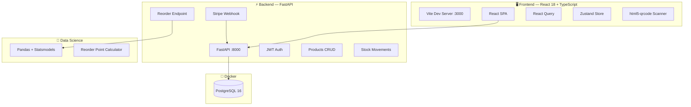

# FluxStock — Intelligent Inventory Management

> Micro-SaaS de gestion de stock intelligent avec prédictions IA, scan de code-barres et monétisation Stripe.  
> Projet Portfolio — Master 1 Informatique

---

## Architecture



### Stack Technique

| Couche | Technologies |
|--------|-------------|
| **Backend** | Python 3.11+, FastAPI, SQLAlchemy 2.0 (async), Alembic, Pydantic v2 |
| **Auth** | JWT (python-jose), Passlib + Bcrypt |
| **Base de données** | PostgreSQL 16, asyncpg |
| **Frontend** | React 18, TypeScript, Vite, Tailwind CSS |
| **State** | React Query (cache serveur), Zustand (state local) |
| **Data Science** | Pandas, Statsmodels, NumPy |
| **Paiement** | Stripe (webhook checkout.session.completed) |
| **DevOps** | Docker, docker-compose |

---

## Structure du Projet

```
FluxStock/
├── docker-compose.yml          # Orchestration des services
├── .env.example                # Template variables d'environnement
│
├── backend/
│   ├── Dockerfile
│   ├── requirements.txt
│   ├── alembic.ini
│   ├── alembic/                # Migrations DB
│   │   ├── env.py              # Config async Alembic
│   │   └── versions/
│   └── app/
│       ├── main.py             # FastAPI app factory
│       ├── core/
│       │   ├── config.py       # Pydantic Settings (.env)
│       │   ├── database.py     # Async SQLAlchemy engine
│       │   └── security.py     # JWT + bcrypt
│       ├── models/
│       │   ├── user.py         # User (email, role, is_premium)
│       │   ├── product.py      # Product (SKU, stock, prix)
│       │   ├── stock_movement.py # Journal d'audit (IN/OUT/LOSS/RETURN)
│       │   └── forecast.py     # Prédictions IA
│       ├── schemas/            # Pydantic v2 request/response
│       └── api/routes/
│           ├── auth.py         # POST /auth/register, /login, GET /me
│           ├── products.py     # CRUD + GET /products/sku/{sku}
│           ├── stock.py        # POST /stock/movements
│           ├── forecast.py     # GET /products/{id}/reorder
│           └── stripe.py       # POST /webhooks/stripe
│
├── frontend/
│   ├── Dockerfile
│   ├── package.json
│   ├── vite.config.ts
│   ├── tailwind.config.js
│   └── src/
│       ├── main.tsx
│       ├── App.tsx             # Router avec routes protégées
│       ├── lib/api.ts          # Axios + JWT interceptor
│       ├── stores/authStore.ts # Zustand (persist localStorage)
│       ├── components/
│       │   ├── Navbar.tsx      # Desktop top bar + mobile bottom bar
│       │   ├── ProtectedRoute.tsx
│       │   ├── PaywallModal.tsx
│       │   └── ProductCard.tsx
│       └── pages/
│           ├── LoginPage.tsx
│           ├── RegisterPage.tsx
│           ├── DashboardPage.tsx      # KPIs + alertes stock
│           ├── ProductsPage.tsx       # CRUD + recherche
│           ├── ScannerPage.tsx        # Scan code-barres
│           └── PremiumDashboard.tsx   # IA (paywall)
│
└── data-science/
    ├── requirements.txt
    └── forecasting.py          # Calcul point de commande
```

---

## Installation & Lancement

### Prérequis
- [Docker](https://docs.docker.com/get-docker/) & Docker Compose
- (Optionnel) Node.js 20+ et Python 3.11+ pour le développement local

### 1. Cloner et configurer

```bash
git clone <repo-url> FluxStock
cd FluxStock
cp .env.example .env
# Éditer .env avec vos clés (DB, JWT, Stripe)
```

### 2. Lancer avec Docker

```bash
docker-compose up --build
```

| Service | URL |
|---------|-----|
| **API (Swagger)** | [http://localhost:8000/docs](http://localhost:8000/docs) |
| **Frontend** | [http://localhost:3000](http://localhost:3000) |
| **PostgreSQL** | `localhost:5432` |

### 3. Première migration

```bash
# Depuis le conteneur backend
docker-compose exec api alembic revision --autogenerate -m "initial"
docker-compose exec api alembic upgrade head
```

### 4. Développement local (sans Docker)

```bash
# Backend
cd backend
python -m venv .venv && source .venv/bin/activate
pip install -r requirements.txt
uvicorn app.main:app --reload

# Frontend
cd frontend
npm install
npm run dev
```

---

## Fonctionnalités Clés

### A. Authentification & CRUD
- **Register / Login** via JWT avec hachage bcrypt
- **CRUD Produits** complet avec ownership (chaque user voit ses produits)
- **Recherche par SKU** pour le scanner de code-barres

### B. Intelligence Artificielle — Point de Commande
L'endpoint `GET /products/{id}/reorder` calcule :

```
d     = demande quotidienne moyenne (90 derniers jours)
d_max = demande quotidienne maximale
L     = délai de livraison fournisseur
L_max = délai maximum

SS = (d_max × L_max) − (d × L)          // Stock de sécurité
RP = (d × L) + SS                        // Point de commande
Réappro = stock_actuel < RP              // Décision
```

### C. Monétisation Stripe
- **Webhook** `/webhooks/stripe` écoute `checkout.session.completed`
- Passe automatiquement `is_premium = True` sur le user
- **Paywall frontend** bloque le Dashboard Pro pour les users gratuits

### D. Scanner Mobile
- Intégration `html5-qrcode` avec accès caméra
- Scan → recherche par SKU → affichage produit ou formulaire de création

---


## API Documentation

La documentation Swagger/OpenAPI est générée automatiquement par FastAPI :

**→ [http://localhost:8000/docs](http://localhost:8000/docs)** (Swagger UI)  
**→ [http://localhost:8000/redoc](http://localhost:8000/redoc)** (ReDoc)

### Endpoints principaux

| Méthode | Route | Description |
|---------|-------|-------------|
| `POST` | `/auth/register` | Créer un compte |
| `POST` | `/auth/login` | Obtenir un JWT |
| `GET` | `/auth/me` | Profil utilisateur |
| `GET` | `/products/` | Lister mes produits |
| `POST` | `/products/` | Créer un produit |
| `GET` | `/products/sku/{sku}` | Recherche par code-barres |
| `PUT` | `/products/{id}` | Modifier un produit |
| `DELETE` | `/products/{id}` | Supprimer un produit |
| `POST` | `/stock/movements` | Enregistrer un mouvement |
| `GET` | `/stock/movements/{product_id}` | Historique mouvements |
| `GET` | `/products/{id}/reorder` | Calcul point de commande (IA) |
| `POST` | `/webhooks/stripe` | Webhook Stripe |

---