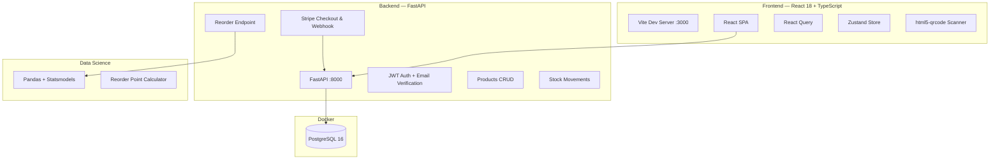

# FluxStock — Intelligent Inventory Management

> Micro-SaaS de gestion de stock intelligent avec prédictions IA, scan de code-barres et monétisation Stripe.  
---

## Architecture



### Stack Technique

| Couche | Technologies |
|--------|-------------|
| **Backend** | Python 3.11+, FastAPI, SQLAlchemy 2.0 (async), Alembic, Pydantic v2 |
| **Auth** | JWT (python-jose), Passlib + Bcrypt |
| **Base de données** | PostgreSQL 16, asyncpg |
| **Frontend** | React 18, TypeScript, Vite, Tailwind CSS |
| **State** | React Query (cache serveur), Zustand (state local) |
| **Data Science** | Pandas, Statsmodels, NumPy |
| **Paiement** | Stripe (Checkout Session + Webhook) |
| **DevOps** | Docker, docker-compose |

---

## Fonctionnalités Clés (Mises à jour)

### 🛡️ Sécurité Renforcée
- **Vérification d'Email** : Système d'inscription avec lien de validation unique envoyé par email.
- **Mots de Passe Robustes** : Validation stricte via Pydantic (8+ chars, majuscule, chiffre, caractère spécial).
- **Contrôle d'Accès** : Connexion impossible pour les comptes non vérifiés.

### 📸 Scanner Mobile "Instant-Search"
Le scanner est maintenant 100% fonctionnel et optimisé pour la rapidité :
- **Scan & Find** : Si le code-barres correspond à un produit existant, l'utilisateur est instantanément redirigé vers sa fiche.
- **Auto-Fill** : Si le produit est inconnu, le formulaire de création s'ouvre automatiquement avec le code SKU déjà rempli.
- **Feedback visuel** : Indicateurs de chargement et gestion des erreurs caméra.

### 💰 Monétisation Stripe Pro
Intégration complète du flux de paiement :
- **Stripe Checkout** : Redirection sécurisée vers la page de paiement Stripe pour l'abonnement Pro.
- **Webhook Temps Réel** : Mise à jour automatique du statut `is_premium` dès la confirmation du paiement.
- **Paywall Intelligent** : Accès restreint au Dashboard IA pour les utilisateurs non-premium.

---

## Installation & Configuration

### 1. Variables d'environnement (.env)
Assurez-vous d'avoir les variables suivantes pour que toutes les fonctionnalités soient actives :

```bash
# Stripe
STRIPE_SECRET_KEY=sk_test_...
STRIPE_WEBHOOK_SECRET=whsec_...
STRIPE_PRICE_ID=price_...

# App
FRONTEND_URL=http://localhost:3000
SECRET_KEY=votre_clé_secrète_jwt

# Email (SMTP)
SMTP_HOST=smtp.mailtrap.io
SMTP_PORT=587
SMTP_USER=...
SMTP_PASSWORD=...
```

### 2. Lancement & Migrations

```bash
docker-compose up --build

# Appliquer les migrations de base de données (pour is_verified, etc.)
docker-compose exec api alembic upgrade head
```

---

## API Documentation

| Méthode | Route | Description |
|---------|-------|-------------|
| `POST` | `/auth/register` | Créer un compte (génère un token de vérification) |
| `GET` | `/auth/verify-email` | Valider un compte via le token reçu par email |
| `POST` | `/auth/login` | Connexion (uniquement pour comptes vérifiés) |
| `GET` | `/products/sku/{sku}` | Recherche instantanée par code-barres |
| `POST` | `/webhooks/stripe/create-checkout-session` | Créer une session de paiement Stripe |

---
